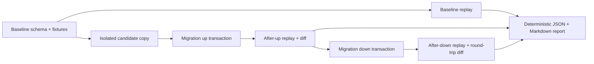

# MigrationReplay

[](https://github.com/b2ty9t7yhz-source/migrationreplay/actions/workflows/ci.yml)
[](CHANGELOG.md)
[](https://openjdk.org/projects/jdk/21/)
[](LICENSE)

Behavioral regression testing for SQLite database migrations.

MigrationReplay executes the same deterministic, read-only query corpus against
baseline, migrated, and rolled-back database states. It compares behavior and
integrity—not just whether migration SQL returned successfully.



## Why it exists

A migration can execute successfully while still losing rows, changing query
results, introducing unexpected `NULL` values, removing an index, or failing to
restore behavior during rollback. MigrationReplay complements migration
frameworks by testing these observable effects. It does not generate or apply
production migrations.

## What it checks

| Signal | Evidence captured |
|---|---|
| Query behavior | Success/error outcome, columns, typed rows, row multiplicity |
| Data integrity | Row counts, non-null assertions, unique query keys |
| Database integrity | SQLite integrity check and foreign-key violations |
| Schema behavior | Tables, indexes, schema SQL, rollback round trip |
| Query plans | `EXPLAIN QUERY PLAN`, plan changes, configured full-scan warnings |
| Reproducibility | SHA-256 input fingerprints and deterministic reports |

Result comparison preserves SQLite runtime types: integer `1`, real `1.0`, and
text `"1"` are distinct values. Unordered comparisons retain duplicate rows as
a multiset. Ordered comparisons require an explicit top-level `ORDER BY`.

## Quick start

Requirements: JDK 21. The checked-in Gradle Wrapper supplies the build tool.

```bash
./gradlew clean check installDist
./build/install/migrationreplay/bin/migrationreplay --version
```

Run the passing migration example:

```bash
./build/install/migrationreplay/bin/migrationreplay \
  run examples/add-user-email \
  --output-dir build/example-report
```

Expected CLI summary:

```text
status=PASS
json=.../build/example-report/report.json
markdown=.../build/example-report/report.md
```

## See a regression get caught

`examples/data-loss-regression` deletes an inactive account during migration up.
Migration down restores the schema but cannot restore the lost row.

```bash
./build/install/migrationreplay/bin/migrationreplay \
  run examples/data-loss-regression \
  --output-dir build/data-loss-report
```

The command exits with code `1` and reports both behavioral and round-trip
violations:

```text
status=FAIL
QUERY_BEHAVIOR_CHANGED
SCHEMA_ROUND_TRIP_MISMATCH
```

The failure is intentional and demonstrates that a syntactically successful
rollback is not necessarily a behavioral rollback.

## Input bundle

Each run reads five UTF-8 files:

```text
baseline_schema.sql
fixtures.sql
migration_up.sql
migration_down.sql
queries.yaml
```

`queries.yaml` defines named parameters, expected outcomes, comparison policy,
row-order semantics, result assertions, plan warnings, and index assertions.
See the [configuration reference](docs/configuration.md) and the
[passing example](examples/add-user-email).

## Reports and exit codes

Every completed replay writes `report.json` and `report.md` atomically. Reports
contain no timestamps, durations, temporary paths, or random identifiers.
Repeated runs with identical inputs and runtime versions are byte-identical.

- `0`: validation succeeded or replay passed
- `1`: replay completed and found one or more violations
- `2`: configuration, safety validation, CLI usage, or report-writing failure

## Safety boundary

MigrationReplay accepts no JDBC URL or database path. It creates databases only
inside a tool-owned temporary directory and opens replay connections as
read-only with SQLite `query_only` enabled. It rejects external-database,
extension-loading, transaction-control, virtual-table, and other unsupported SQL
before execution.

Input SQL must still come from a trusted repository. The lexical policy is
deliberately conservative; it is not a sandbox for hostile SQL. See the full
[safety model](docs/safety-model.md).

## Quality gates

- Java 21 compilation with all compiler warnings treated as errors
- 70 automated unit, component, and integration tests
- Enforced JaCoCo minimums: 84% line and 65% branch coverage
- Transaction rollback and deterministic-report regression tests
- CI-built installation ZIP, separate packaged-CLI smoke tests, and report artifacts
- Gradle Wrapper distribution checksum and dependency update automation

Run the same gate used by CI:

```bash
./gradlew clean check installDist distZip --no-daemon
```

## V1.0.0 scope

V1 supports SQLite, deterministic synthetic fixtures, local temporary database
copies, one migration pair, and a read-only query corpus. It intentionally does
not support PostgreSQL/MySQL, production connections, migration generation,
online schema changes, query capture, a web UI, or performance benchmarking.
It does not claim to prove that a migration is absolutely safe.

## Documentation

- [Architecture](docs/architecture.md)
- [Configuration reference](docs/configuration.md)
- [Canonicalization rules](docs/canonicalization.md)
- [Report schema](docs/report-schema.md)
- [Safety model](docs/safety-model.md)
- [Test strategy](docs/test-strategy.md)
- [Release checklist](docs/release-checklist.md)
- [Changelog](CHANGELOG.md)
- [Security policy](SECURITY.md)

## License

MIT. See [LICENSE](LICENSE).
